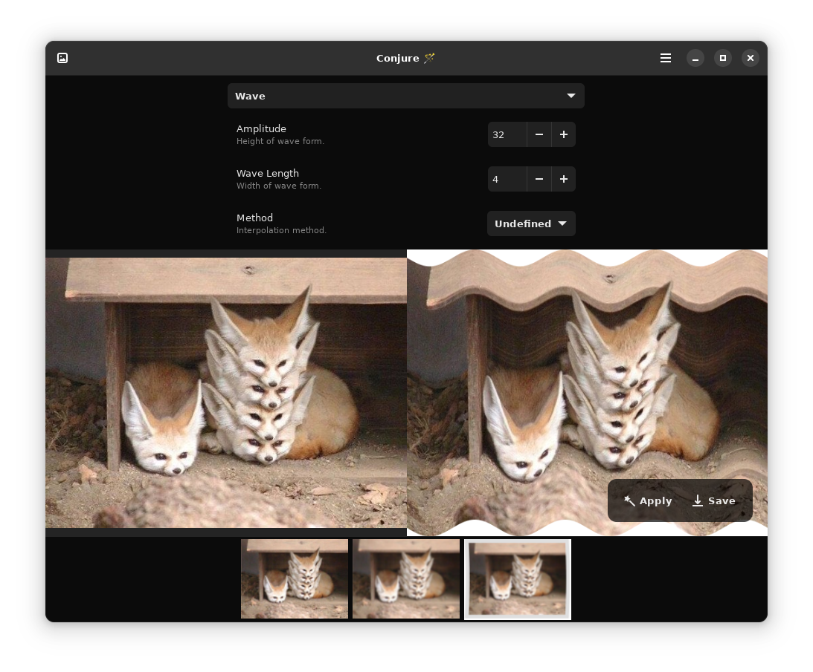
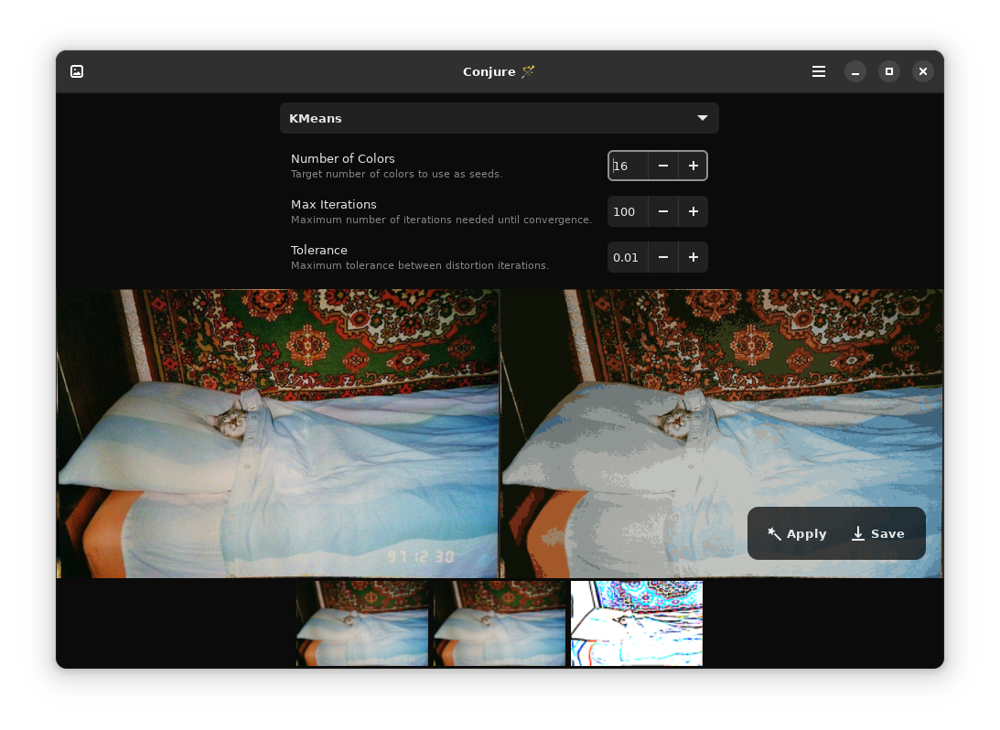

Conjure
======

Magically transform your images with Conjure. 
Resize, crop, rotate, flip images, apply various filters and effects, adjust levels and brightness, and much more.
An intuitive tool for designers, artists, or just someone who wants to enhance their images.

Built on top of the popular image processing library, [ImageMagick](https://github.com/ImageMagick/ImageMagick) with python bindings from [Wand](https://github.com/emcconville/wand).

  

Flatpak
--------------

You can install stable builds of Conjure from [Flathub](https://flathub.org)
by using this command:

    flatpak remote-add --if-not-exists flathub https://flathub.org/repo/flathub.flatpakrepo
    flatpak install flathub io.github.nate_xyz.Conjure

Screenshots
--------------

